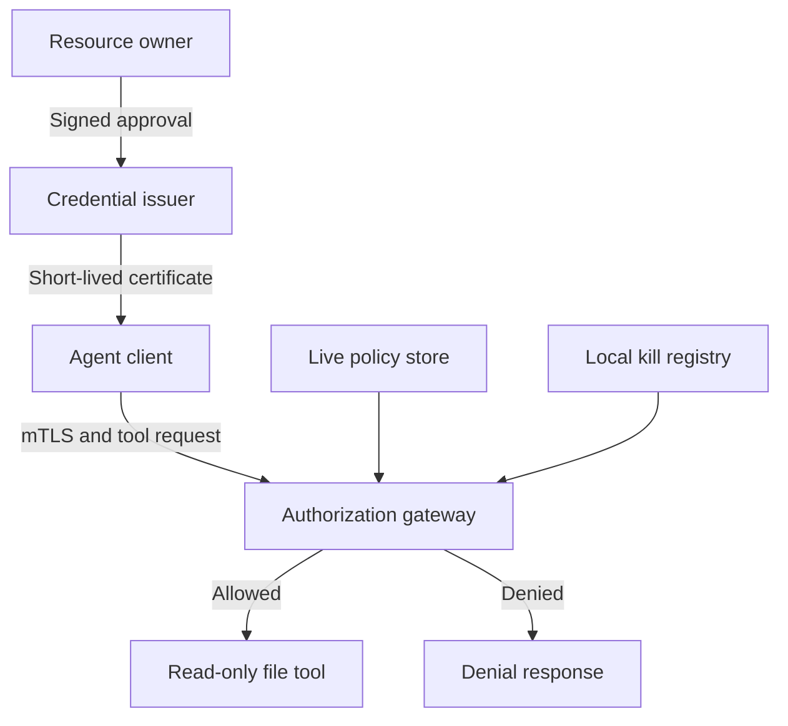

# X.509 Authorization for AI Agents

A Python research prototype exploring where an AI agent's tool permissions should live: in its certificate, in server-side policy, or in both.

A certificate can prove an agent's identity. This project asks a separate question: **what is that agent allowed to do, and how can that authority change while it is running?** It compares five authorization models using the same requests, policy rules, and local revocation checks.

## Quick start

Use Python 3.11+ and OpenSSL on Linux or WSL. The file tool uses POSIX directory-descriptor operations.

```bash
git clone https://github.com/manojbagale/x509-agent-authorization.git
cd x509-agent-authorization
python -m venv .venv
source .venv/bin/activate
python -m pip install -e ".[dev]"
python scripts/demo.py
```

The demo starts a local server and client, approves a short-lived agent certificate, and makes seven requests over one mTLS connection. You will see an allowed file read, denied shell and out-of-scope requests, a policy change that blocks access, restored access, and two denials after the credential is killed. Only the two allowed reads reach the file tool.

Run the tests with `python -m pytest`. To save the full demo output, use `python scripts/demo.py --output .local-runs/demo.json`.

## How it works

The resource owner approves an identity and a set of permissions. The issuer checks that signed approval before creating a credential. Once the agent connects, the gateway checks each tool request against its current authority before dispatching it.



The demo uses the **signed-ceiling** model: a request must match both the current server policy and the maximum permissions signed into the certificate. A trusted administrator can narrow access immediately; granting access beyond that maximum requires a new certificate. Expiry and local revocation are checked on every call, including calls on an existing connection.

| Model | Where permissions live | Policy changes without reissuing |
|---|---|---|
| `certificate` | Signed certificate extension | Fixed until reissue |
| `external` | Server policy for the agent identity | Narrow or expand |
| `hybrid` | Named server policy referenced by the certificate | Narrow or expand |
| `hybrid_ceiling` | Named server policy plus a signed maximum | Change within the maximum |
| `token` | Server policy referenced by an opaque bearer token | Narrow or expand |

All five support a local kill operation. It blocks subsequent calls; it does not cancel an operation already executing. The token model is a comparison baseline, with different authentication guarantees from certificate private-key possession.

## Code

The end-to-end flow is in [`run_mtls_demo()`](agent_auth/mtls_demo.py): credential approval and issuance, server setup, request handling, then client calls. The underlying pieces are small modules:

| File | Responsibility |
|---|---|
| [`approval.py`](agent_auth/approval.py) | Owner-signed permission grants and approved issuance |
| [`pki.py`](agent_auth/pki.py) | Local CA, certificates, and authorization extension encoding |
| [`policy.py`](agent_auth/policy.py) | Policy store, path rules, and permission matching |
| [`gateway.py`](agent_auth/gateway.py) | Certificate validation, sessions, per-call decisions, and audit |
| [`tool_dispatch.py`](agent_auth/tool_dispatch.py) | Bounded file reads beneath a server-owned directory |
| [`token_baseline.py`](agent_auth/token_baseline.py) | Opaque-token issuance and authorization using the same policy rules |

[`scenarios.py`](agent_auth/scenarios.py) defines the shared policies and request cases. [`evaluation.py`](agent_auth/evaluation.py) runs the five-model comparison. Tests under [`tests/`](tests/) cover each component and the complete network demo.

## Experiments

```bash
python -m agent_auth.evaluation
python scripts/show_results.py
```

Fresh results go to `.local-runs/`, which is ignored by Git. The default evaluation runs ten rotated comparisons with 2,000 authorization samples per model per run. Use `--runs`, `--iterations`, `--warmup`, and `--output-dir` to change those settings.

Published snapshots live under [`results/`](results/README.md), grouped by date. The October 5 run recorded 50 matching model/case decisions and 1,500 successful local kill trials. Its source hashes and raw samples are preserved alongside the summary. These are deterministic local experiments, not production performance or general security guarantees.

The earlier four-certificate study remains available through `scripts/run_experiments.py` and `scripts/benchmark.py`; it includes certificate-size scaling. `scripts/generate_evidence.py` runs the OpenSSL critical-extension checks. Their output also stays under `.local-runs/`.

## Scope and further work

This is a single-host research implementation with a local CA, in-memory policy, and a custom JSON protocol over TLS. The file tool performs real reads; DNS cases are authorization checks only. It does not yet integrate an MCP runtime or provide process isolation for an untrusted agent.

The next steps are an actual MCP tool path, networked policy and revocation state, fuller certificate-path validation, and concurrency and failure testing.

- [Experiment design and measurement definitions](docs/experiment-design.md)
- [Research notes](docs/research-notes.md)
- [Standards and references](docs/references.md)
- [Security assumptions and limitations](SECURITY.md)
