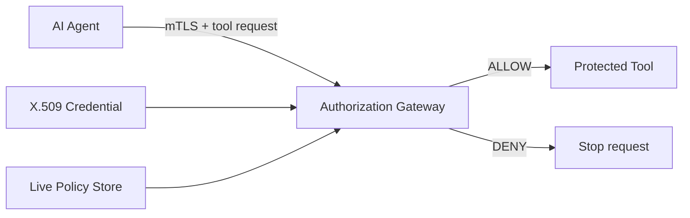

# X.509 Authorization for AI Agents

[](https://github.com/manojbagale/x509-agent-authorization/actions/workflows/ci.yml)

A research prototype for one question:

> **How much of an AI agent's authority should be carried in an X.509 credential, and which authorization decisions should remain in a live policy system?**

AI agents increasingly call real tools: filesystems, APIs, databases, shell commands, and cloud services. Once an agent can act, authentication is not enough. A correctly authenticated agent can still attempt an action it should not be allowed to perform.

This project studies X.509 as the cryptographic identity layer and experimentally compares four ways to enforce least privilege at the tool boundary.

## Why this project exists

The security goal is **containment**, not perfect prevention. Assume an agent can eventually be manipulated, compromised, or simply make a bad decision. The surrounding system should still bound what that agent can do.



The gateway is intentionally outside the agent's trust boundary. The protected tool is expected to be reachable only through that gateway.

## Authorization models

| Model | X.509 carries | Live policy | Key trade-off |
|---|---|---|---|
| **Certificate-native** | identity + permissions | No | signed and self-contained, but authority is static until reissuance/expiry |
| **External** | identity only | Yes | easy to change at runtime, but policy becomes an online dependency |
| **Hybrid reference** | identity + policy ID | Yes | binds a session to a policy reference, but live policy can still broaden authority |
| **Hybrid signed ceiling** | identity + policy ID + maximum permissions | Yes | live policy can narrow authority but cannot expand past the signed ceiling |

The fourth model is the most important refinement in the current prototype: it separates **who may change policy at runtime** from **the maximum authority the certificate issuer signed**.

## What is implemented

- Local ECDSA research CA and short-lived X.509 agent certificates
- URI SAN workload identity under `spiffe://seminar.fisk.edu/agent/...`
- Basic Constraints, Key Usage, and `clientAuth` EKU profile checks
- Experimental private X.509 extension for certificate-carried authorization
- Four authorization modes using the same request matrix
- Real localhost **TLS 1.3 mutual authentication** demo
- Per-request complete mediation at an authorization gateway
- Deny-by-default tool/action/resource matching
- Resource canonicalization for traversal and prefix-confusion cases
- Runtime kill registry
- Negative credential/profile tests
- OpenSSL critical-extension interoperability experiment
- Certificate-size scaling measurements
- Repeated local latency measurements

> [!WARNING]
> This is a research prototype, not a production PKI or policy engine. It deliberately uses a small trust model and simplified application policy so individual security properties can be tested clearly.

## Current results

The current test suite contains **20 passing tests**.

Across the bounded 10-request correctness matrix for each of the four authorization modes:

- false allows: **0**
- false denies: **0**

Additional negative tests verify rejection of a wrong private key, expired credential, wrong issuer, CA certificate used as a leaf, wrong trust domain, and multiple URI SAN identities.

### Dynamic policy behavior

| Model | Runtime narrowing | Runtime expansion without reissue |
|---|---:|---:|
| Certificate-native | No | No |
| External | Yes | Yes |
| Hybrid reference | Yes | Yes |
| Hybrid signed ceiling | Yes | **No** |

This is the central experimental result so far. A policy reference alone does not cryptographically prevent later privilege expansion. The signed-ceiling variant does.

### Certificate size

Median DER size across 15 independently issued certificates per point:

| Permissions | Certificate-native | External | Hybrid reference | Hybrid signed ceiling |
|---:|---:|---:|---:|---:|
| 0 | 557 B | 488 B | 570 B | 599 B |
| 1 | 633 B | 488 B | 570 B | 675 B |
| 10 | 1,304 B | 488 B | 570 B | 1,344 B |
| 100 | 7,964 B | 488 B | 570 B | 8,004 B |

Certificate-native authority grows with the number of embedded permissions. External and policy-reference certificates remain effectively constant in this experiment.

### Local latency

Across 10 repeated in-process runs, median p95 policy-decision latency was approximately:

- certificate-native: **0.0066 ms**
- external: **0.0067 ms**
- hybrid reference: **0.0068 ms**
- hybrid signed ceiling: **0.0078 ms**

These numbers are only a Python/local microbenchmark. They do **not** represent production network latency or throughput.

### mTLS proof of possession

The network demo completed a real localhost TLS 1.3 mutual-authentication handshake using the research CA. The gateway extracted the peer certificate after the TLS handshake, opened an application session, allowed an in-scope file read, and denied an unauthorized shell request.

See [`results/mtls_output.json`](results/mtls_output.json).

### Critical-extension interoperability

RFC 5280 requires an implementation to reject a certificate containing an unrecognized **critical** extension. The prototype reproduces that trade-off with OpenSSL:

- non-critical experimental authorization extension → generic OpenSSL verification succeeds
- critical experimental authorization extension → OpenSSL fails with `unhandled critical extension`

See [`evidence/`](evidence/).

## Run it

```bash
git clone https://github.com/manojbagale/x509-agent-authorization.git
cd x509-agent-authorization

python -m venv .venv
source .venv/bin/activate   # Windows: .venv\Scripts\activate
pip install -e ".[dev]"

pytest
python scripts/run_experiments.py
python -m agent_auth.mtls_demo
python scripts/benchmark.py
```

## Repository layout

```text
agent_auth/                 core PKI, gateway, experiment, and mTLS code
scripts/                    experiment/evidence entry points
tests/                      correctness, profile, interoperability, and mTLS tests
results/                    measured outputs used in the research report
evidence/                   OpenSSL verification and certificate inspection output
docs/                       research notes, experiment design, and references
.github/workflows/ci.yml    test matrix for Python 3.11–3.13
```

## Research interpretation

The current evidence supports a narrower claim than "put permissions in certificates":

1. **X.509 is a strong fit for cryptographic workload identity and key possession.**
2. **Certificate-carried authorization can work for stable, issuer-bounded, session-scoped authority.**
3. **A live policy plane is much better at rapid authorization changes and remediation.**
4. **A policy reference alone is not an authority ceiling.** If the referenced policy can later broaden, the agent can gain authority without certificate reissuance.
5. **A hybrid signed ceiling is a promising compromise:** the certificate bounds maximum authority while the online policy can narrow it dynamically.

That interpretation is consistent with established separation between identity credentials and authorization data in standards such as RFC 5755 and RFC 8705, while still leaving a useful experimental role for X.509-carried capability information.

## Research notes and sources

- [Experiment design](docs/experiment-design.md)
- [Weeks 5–6 research notes](docs/research-notes.md)
- [Primary references](docs/references.md)

## Status

Active senior-seminar research. The next phase is to move beyond the local prototype: strengthen PKIX validation, put the gateway in front of a real MCP tool path, expand argument-level policies, and measure networked authorization and revocation behavior under concurrency.
